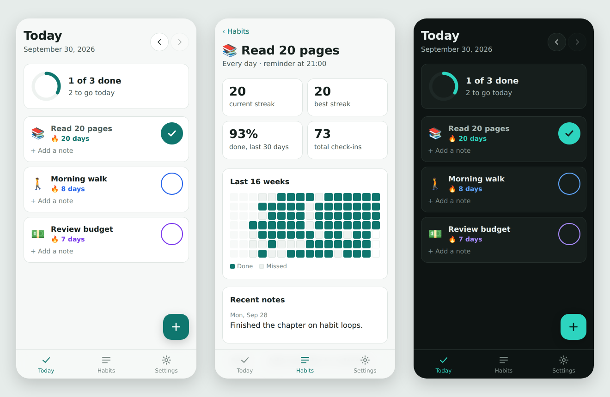

# Habit Tracker

A private, offline habit tracker that installs on your phone like an app. You add the habits you want to build, check them off each day, and watch your streaks grow. Everything stays on your device, with no account, no server, and no tracking.

**Try it:** https://rushmaparajuli39.github.io/Android-Productivity-Tracker-App/



## Features

- **Daily checklist.** Tap to check a habit off, with a progress ring for the day. You can step back to earlier days to fill in anything you missed.
- **Flexible schedules.** A habit can repeat every day, on weekdays, or on any days you pick. Days a habit isn't scheduled never break its streak.
- **Streaks and stats.** Current and best streak, the share of scheduled days done in the last 30 days, total check-ins, and "perfect days" when everything was done.
- **16-week history.** A calendar grid for each habit shows at a glance which days were done and which were missed.
- **Notes.** Add a short note to any habit on any day ("felt tired, did 10 pages") and see recent notes on the habit's page.
- **Reminders.** Pick a time and the app creates a recurring calendar event, so your phone's own calendar reminds you on the right days.
- **Works offline and installs.** It's a progressive web app (PWA): add it to your home screen and it opens full screen, with or without a connection.
- **Backup and restore.** Download all your data as a JSON file and restore it on any device.
- **Light and dark mode**, following your phone's setting.

## Install on your phone

1. Open the link above on your phone.
2. **iPhone (Safari):** tap **Share**, then **Add to Home Screen**.
   **Android (Chrome):** tap **Install app** in Settings inside the app, or in the browser menu.

## Your data

Habits and history are saved in your browser's local storage on that device only. Nothing is sent anywhere. That also means:

- Clearing your browser's site data erases it, so use **Settings → Download backup** now and then.
- Data doesn't sync between devices. To move phones, download a backup on the old one and restore it on the new one.

## How it's built

Plain HTML, CSS, and JavaScript (ES modules), with no framework and no build step.

| File | What it does |
|---|---|
| `js/lib.js` | Core logic with no DOM access: dates, streaks, stats, backup validation, calendar reminders |
| `js/app.js` | Screens, navigation (hash routes, so the back button works), storage, and user actions |
| `css/app.css` | Mobile-first styles with light and dark themes |
| `sw.js` | Service worker that caches the app so it runs offline |
| `manifest.webmanifest` | App name, icons, and colors used when it's installed |
| `tests/lib.test.js` | Unit tests for the core logic, run in CI on every push |

A few decisions worth noting:

- **Dates are local calendar days** stored as `YYYY-MM-DD`, and all date math goes through the local calendar, so daylight-saving changes never shift a check-in to the wrong day.
- **An unfinished today doesn't break a streak.** Streaks count from yesterday until today's check-in happens, so the number doesn't drop to zero every morning.
- **Reminders use the calendar.** A web app can't reliably fire scheduled notifications without a push server, so the app exports a standard `.ics` event instead.

## Run it locally

```bash
npm start      # serves the app at http://localhost:8000
npm test       # runs the unit tests (Node 20+)
```

A service worker needs `localhost` or HTTPS, which both commands above satisfy. When you change a cached file, bump `VERSION` in `sw.js` so installed copies update.

## Roadmap

- Optional sign-in and sync across devices (Supabase)
- Weekly and monthly targets ("3 times a week")
- Charts of completion over time

## Background

This repo started in 2022 as a plan for a native Android (Java) habit app. It's been rebuilt as a PWA so one codebase runs on any phone.
